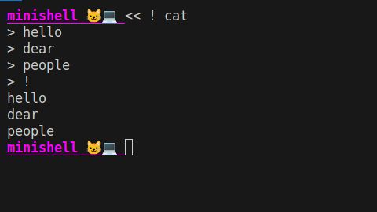

# miniSHELL😸
Fully functional shell for your command-line needs!


## How to compile
```
make && ./minishell
```
____________________________________________
## Introduction
🔥miniSHELL is a compact yet powerful shell application designed to provide a seamless command-line experience. Whether you're a seasoned developer or a casual user, miniSHELL offers a range of features to enhance your workflow, from basic command execution to advanced functionalities like redirections and environment variable management.

_Note: The codebase follows the norms specified by Norminette._
## Features
☑️ Command Execution:

    Execute basic commands like ls, echo, cat, etc.
    Support for command-line arguments and options.

☑️ Redirections:

    Redirect input and output using <, >, >>.
    Handle redirections with pipes (|).

☑️ Environment Variables:

    Set and unset environment variables using export and unset.
    Interpret and expand environment variables in commands.

☑️ Built-in Commands:

    Implement built-in commands such as cd to change directories.
    Handle echo with support for special characters.

☑️ Error Handling:

    Provide meaningful error messages for various scenarios.
    Proper exit status handling for child processes.

☑️ Control Flow:

    Support for pipes in command execution.
    Manage command execution in pipelines.

☑️ Heredoc:

    Implement heredoc functionality for multiline input.
    Handle interruption with Ctrl+C and Ctrl+\.

☑️ Signal Handling:

    Respond appropriately to signals like Ctrl+C.
_________________________________________________________

## Usage
To use miniSHELL, simply compile the application using the provided instructions and run the executable. Once launched, you can start entering commands and leveraging the various features offered by miniSHELL.
